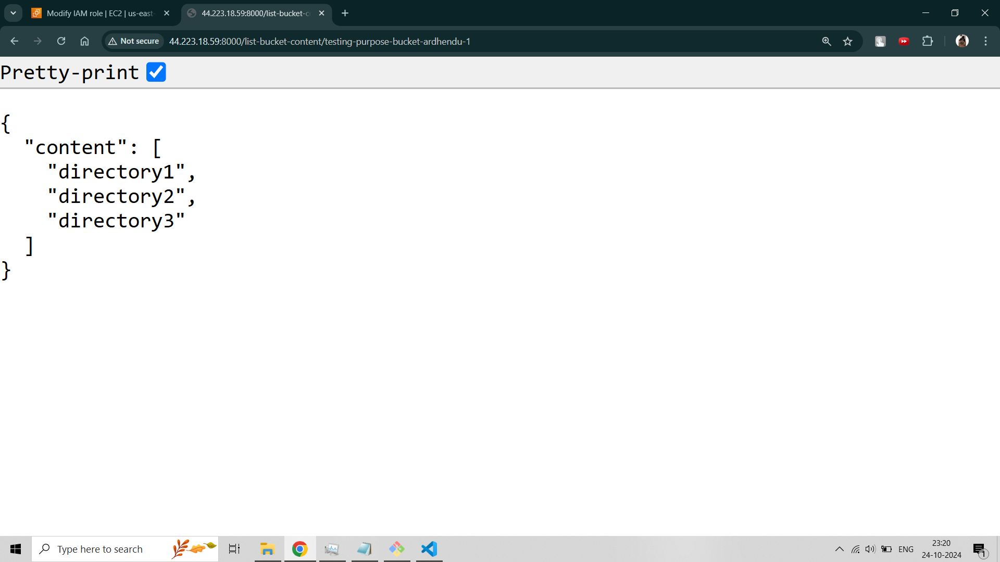
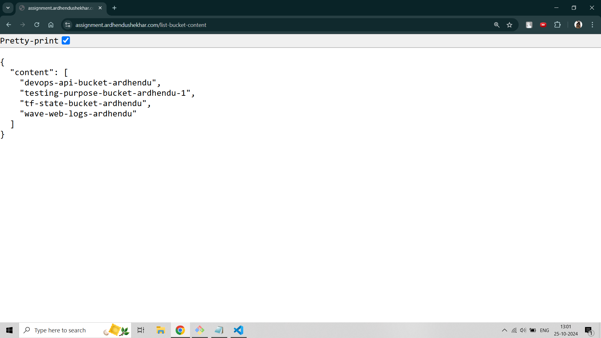
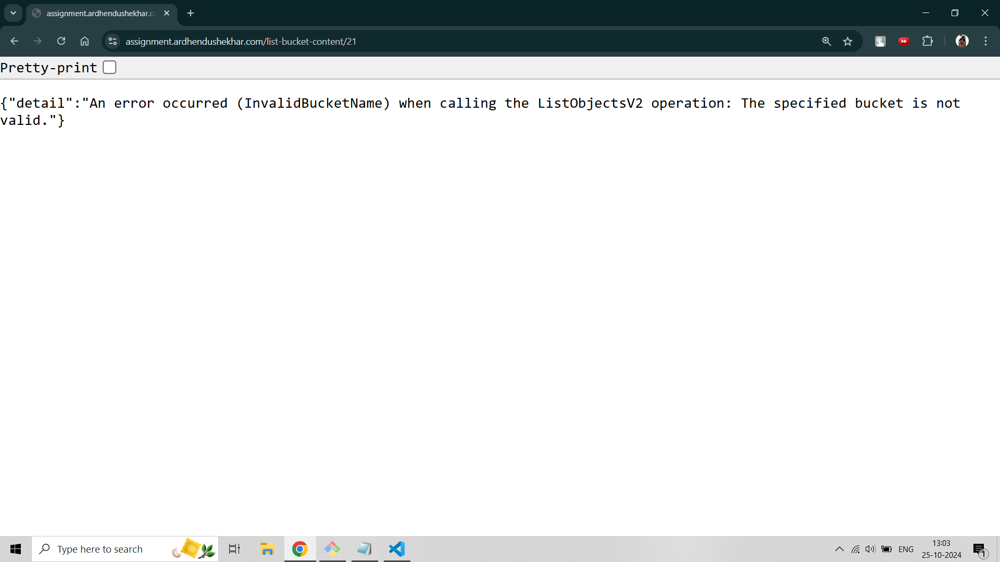
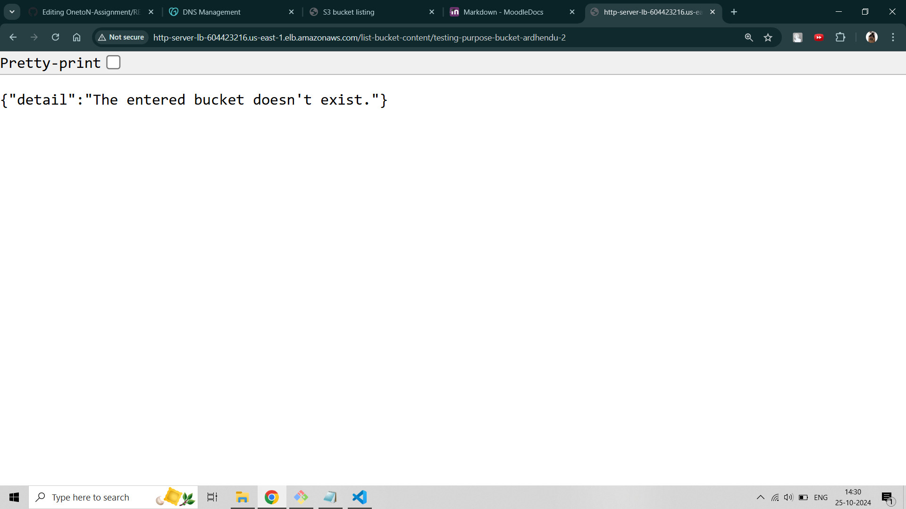
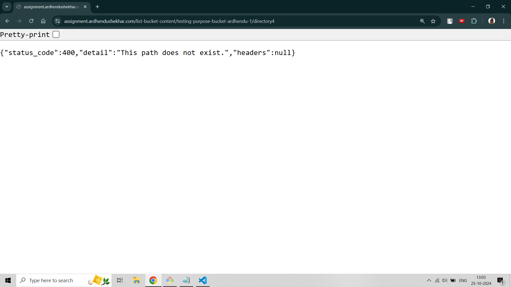
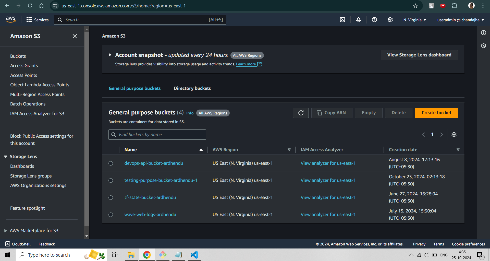
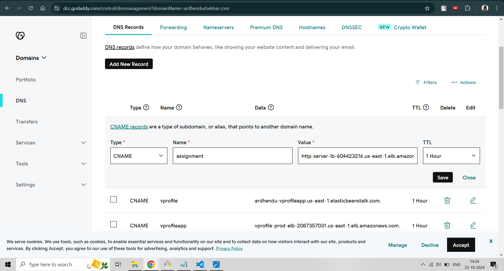
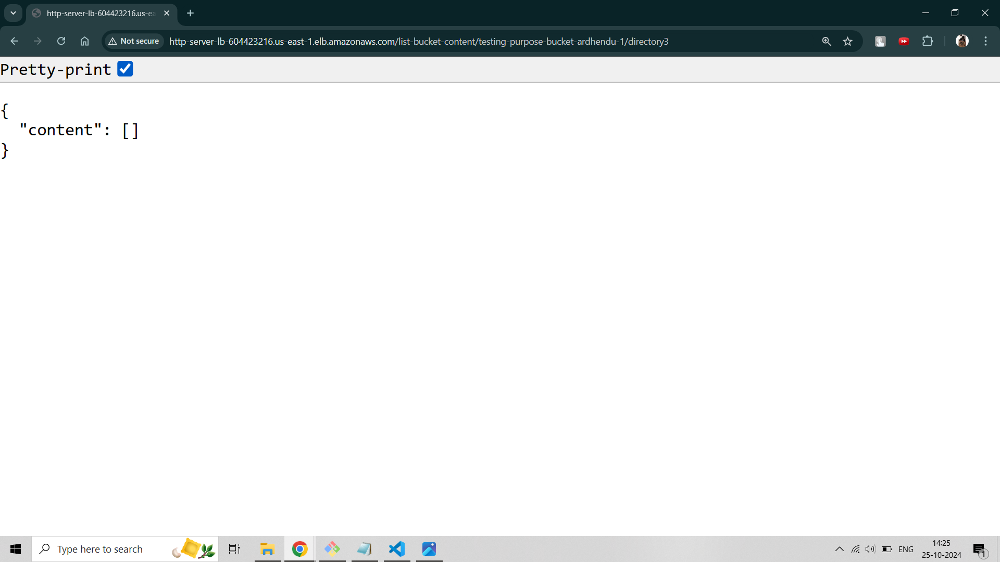
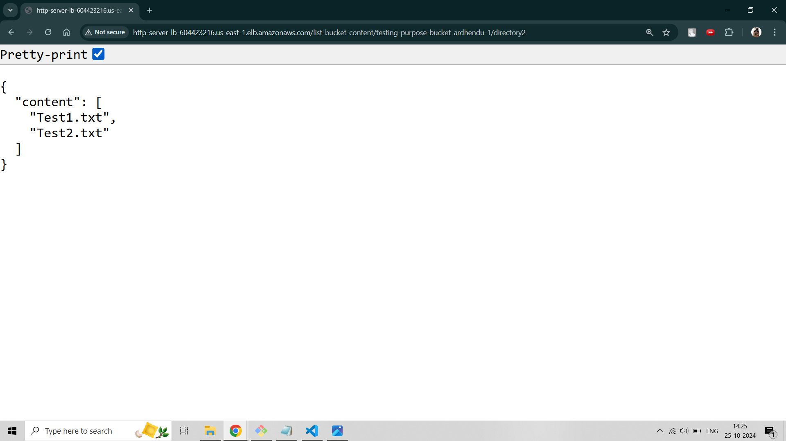

# HTTP-Server using FlaskAPI

## Overview and What it does
The code exposes an http service in Python and makes usage of FastAPI for schema validation, path parameters and routing. It exposes an endpoint and makes a GET "http://DNS-Endpoint/list-bucket-content/<path>" request. This endpoint returns the content of an S3 bucket path as specified in the request. 


If no path is specified, top-level content, the list of buckets for the authenticated AWS user account is returned. The response JSON looks something like
```
{
  "content": [
    "devops-api-bucket-ardhendu",
    "testing-purpose-bucket-ardhendu-1",
    "tf-state-bucket-ardhendu",
    "wave-web-logs-ardhendu"
  ]
}
```
The ideal use case of the service would look like

* For GET http://DNS-Endpoint/list-bucket-content/tf-state-bucket-ardhendu
```
{
  "content": [
    "directory1",
    "directory2",
    "directory3"
  ]
}
```

* For GET http://DNS-Endpoint/list-bucket-content/tf-state-bucket-ardhendu/directory1 or /directory2
```
{
  "content": [
    "strings2.py",
    "text.txt.bak"
  ]
}
```

* For GET http://DNS-Endpoint/list-bucket-content/tf-state-bucket-ardhendu/directory3
```
{
  "content": []
}
```
where directory1 and directory2 contain 2 objects each and directory3 is empty.

## Required Dependencies

1. A free-tier AWS account
2. For SSL, a domain.
3. Python3 
4. FastAPI with uvicorn (to run the process)
5. Terraform

## Additions and Assumptions
1. Instead of an IP:PORT combination, an ELB endpoint is used. This makes it easier to make the traffic HTTPS compatible later.
2. Top-level content is assumed to be the list of buckets for the authenticated AWS user account.
3. DNS entries to a domain (personal) are made to redirect the traffic to the load balancer endpoint and in turn, to the server.

## How it works

### Functionality
Through a FastAPI instance we do the following:
1. Write path parameters according to the requirement given in the problem statement.
2. Write a default route for the load balancer endpoint.
3. The code further filters out the required "content" according to the request received and path parameter.

### Provisioning
Through the Infrastructure as Code (Terraform) structure, we do the following:
1. Start an EC2 instance with an Ubuntu AMI in a target group with a provisioned user_data script to make sure the HTTP server is up and running at port 8000.
2. Provision a load balancer with proper security group rules, target group attachment and listeners for both HTTP and HTTPS traffic forwarding traffic to the instance internally through the VPC properly.
3. Associate the HTTPS listener with SSL certificate (Amazon issued).
4. A separate S3 bucket is used to store the IAC state file remotely to avoid infrastructure mismatch.
5. Importantly, to authenticate to the AWS API, a role (least privileged) is attached to the EC2 instance using an instance profile.

### Screenshots with references

*Figure 1: Top-level access using IP and Port configuration*


*Figure 2: Top-level access using HTTPS endpoint*


*Figure 3: Invalid path error*


*Figure 4: Non-existing bucket error*


*Figure 5: Non-existing path error*


*Figure 6: S3 buckets*


*Figure 7: DNS entries*


*Figure 8: Directory3*


*Figure 9: Directory2*


*Figure 10: Directory1*


## Limitations
* The service cannot respond to nested paths within a bucket. For example, http://DNS-Endpoint/list-bucket-content/bucket_name/directory1/directory2 is something it cannot presently handle. However, it is possible through the boto3 module provided in python3, which AWS uses.
